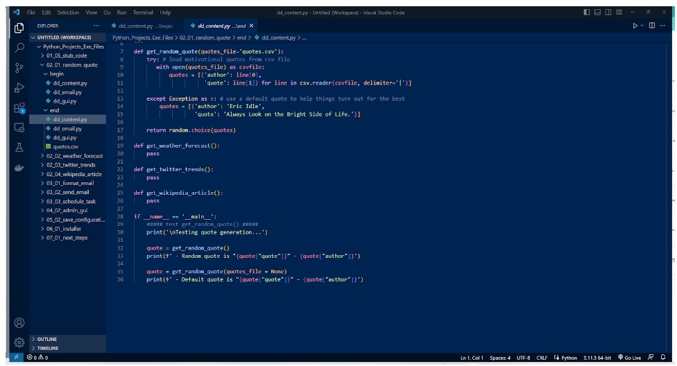

# Python-Week-3
Python Week 3

Week 3 mainly focused on the theory side of programming, like what should the program accomplish and all the thing you can accomplish by automating processes.

# 1.Project Planning 

But before we dive deeper into this project, take a moment and urge you to do something important. Pause for a while and brainstorm at least three project ideas that are inspired by your own life. Jot them down on paper or type them out on your device.
    - A notepad application to take notes for efficiently
    - A music app to play music on my phone and categorize them automatically
    - A app that has plans out my week and what to accomplish, achieving goals and planning of study times

User stories can be added to the application in the format of "As a, I want, So that" 

Remember, when writing user stories, focus on the user's goals and reasons, rather than specific interface details or implementation methods. Take a moment to write your own set of user stories for your Python project before proceeding with this course. This practice will be valuable for your project development.

Apart from user stories, another useful planning tool for applications is called a use case. Use cases typically include a title, an actor (a user or system), and a scenario that describes how a goal is achieved.

Apart from the user stories and use cases there are also the traditional requirements of the application.

These requirements are kept at a high level, omitting specific details such as the forecast duration or temperature unit. For personal projects, this level of detail suffices, and elaboration can be left for implementation. Additional functional requirements related to the admin include configuring content sources, adding and removing recipients, scheduling the email digest, and setting email account credentials.

# Architecture

Now that the requirements are captured, it's time to organize and structure the code for the application. With Python being an object-oriented programming language, considering objects and classes is essential. Looking at the requirements, use cases, and user stories, identifying nouns helps determine potential objects. For instance, in the functional requirements, words like quote, forecast, location, trends, article, content, email, and recipients stand out as potential objects.

# 1.Content Retrieval

Daily inspirational quotes

4 functions will be added to dd_content.py

To implement the "get_random_quote" function, the source of random quotes needs to be determined.

In the "dd_content.py" file, the "get_random_quote" function is implemented, starting at line seven. The function takes a named parameter for the quotes file location, with a default value of "quotes.csv".

At line 17, the random module's "choice" function is used to select a random quote from the list, which is then returned as a dictionary object. In the main execution block, testing code is added to demonstrate the quote generation functionality. The "get_random_quote" function is called without an input argument, and the returned quote is printed. Another test is performed by setting the quotes file argument to None, triggering the exception clause and returning the default quote.

Running the script will display the generated quotes. The first quote is retrieved from the "quotes.csv" file, and the second quote is the default quote by Eric Idle, as expected.

The get weather forecast will use a JSON API from the Open weather api.

During the development of the DD content module, a way was needed to fetch current Twitter trends. Luckily, Twitter offers an API for developers to access this information.

To start using Tweepy, install it on your computer using the command "pip install tweepy." Then, in your code, import the Tweepy module and define a function called "get_twitter_trends" with an optional parameter for the WOEID value. Similar to the previous function, enclosed in the code within a try block to handle potential errors. The Twitter API key and secret key for authentication is provided. On line 55, the "trends_place" method from Tweepy's API class is used to retrieve the current trends for the specified WOEID. The function returned the trends as a list of dictionaries, each containing information about a trend.

